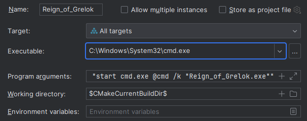

# Reign of Grelok

### Table of contents
* [General info](#general-info)
* [How to play](#how-to-play)
* [Game lore](#game-lore)
* [Gameplay](#gameplay)
* [Authors](#authors)

### General info
This is a mini text adventure game written in C++. Original version of game was used in one of the [terminals](https://fallout.fandom.com/wiki/Reign_of_Grelok) in [Fallout 3](https://en.wikipedia.org/wiki/Fallout_3) by Bethesda Game Studios.

### How to play
To play a game you need:
* to have an IDE(in this case i will use CLion);
* Go to "Edit configurations";
* Edit parameters as on the photo: 
  
* Run program

### Game lore
You play as [Grognak](https://fallout.fandom.com/wiki/Grognak), a mighty barbarian, and your goal is to put an end to the terrible reign of [Grelok](https://fallout.fandom.com/wiki/Grelok), an evil wizard.

### Gameplay
To play this game you need 3 buttons:
* Enter: to confirm yout choice;
* Arrows Up and Down: to switch between menu items.

### Authors
Original mini-game: Copyright (c) 2008 Bethesda Game Studios, [Fallout 3 developers](http://fallout.wikia.com/wiki/Fallout_3_developers)

C++ rewrite: Copyright (c) 2024 without eyes
